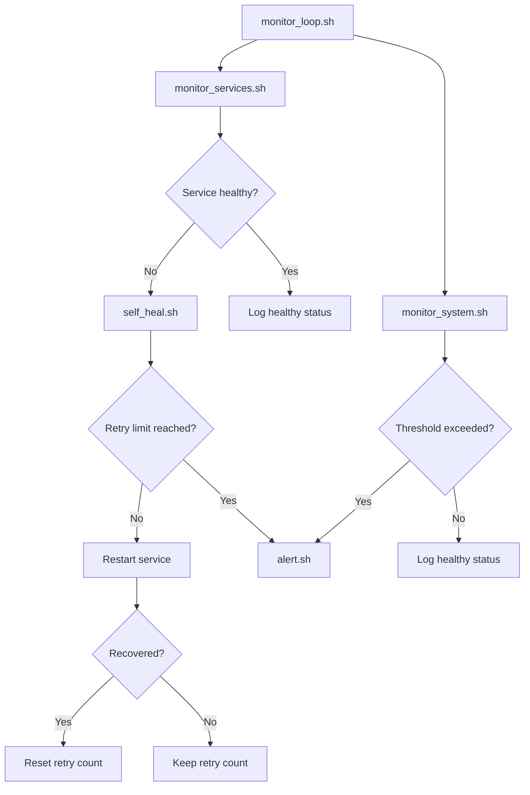

# Architecture

This project is a small Linux reliability automation tool.

## Components

- `monitor_loop.sh`: runs service and system checks continuously.
- `monitor_services.sh`: reads `config/services.conf` and checks each configured service.
- `self_heal.sh`: restarts unhealthy services and tracks retry attempts.
- `monitor_system.sh`: checks disk, memory, and load thresholds.
- `alert.sh`: writes alerts to logs and optionally sends email or Slack notifications.
- `common.sh`: shared logging, config loading, health checks, and retry state helpers.

## Basic Flow

## State And Logs

Retry state is stored in the `state/` directory by default.

Logs are stored in `logs/monitor.log` by default.

Both paths can be changed in `config/monitor.conf`.

